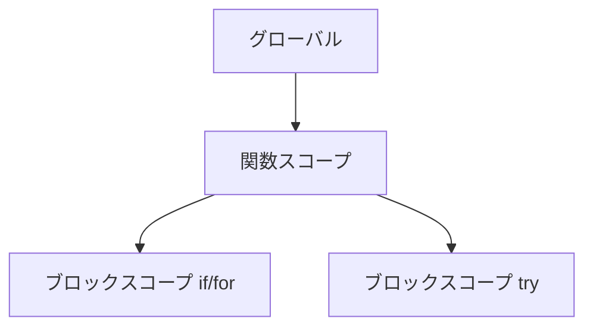

# Week2 教科書：関数・スコープ・配列・オブジェクト（JavaScript 基礎）

このドキュメントは、[JavaScript/docs/schedule_t.md](JavaScript/docs/schedule_t.md) の **2週目**に出てくる技術知識を、手を動かしながら理解できる形でまとめた「教科書」です。

- 対象：関数宣言・関数式・アロー関数 / スコープ / 配列操作 / ループ×配列 / オブジェクト
- 目的：2週目のお題（関数練習セット、成績管理、TODOリスト）を「迷わず書ける」状態にする

---

## 0. まず結論（この週で身につける型）

- **関数**：入力（引数）→処理→出力（戻り値）を小さく切る
- **スコープ**：変数が「どこで見えるか」を固定してバグを減らす（基本は `const`、必要なときだけ `let`）
- **配列**：
  - 末尾操作：`push` / `pop`
  - 先頭操作：`shift` / `unshift`
  - 検索：`includes` / `indexOf`
  - 切り出し：`slice`
  - 変更：`splice`
- **ループ×配列**：`for` / `for...of` で「集計・検索・抽出」を書く
- **オブジェクト**：`{ key: value }` でデータをひとまとまりにする（TODOの `{id, title, done}` が典型）

---

## 1. 関数（宣言・式・アロー）

### 概念（何を解決するか）
関数は「処理のまとまり」を **名前で呼び出せる**ようにする仕組みです。

- 同じ処理を何度も書かない（再利用）
- 目的ごとに分けて読みやすくする（分割）
- 入力→出力がはっきりしてテストしやすい（検証）

### 1-1. 関数の3つの書き方（早見表）

| 種類 | 書き方 | 特徴 | いつ使う？ |
|---|---|---|---|
| 関数宣言 | `function add(a, b) { ... }` | 先に呼んでも動く（巻き上げ / hoisting される） | 基本形。まずはこれでOK |
| 関数式 | `const add = function(a, b) { ... }` | 変数に入れるので「その行より前」では使えない | コールバックや条件で差し替えるとき |
| アロー関数 | `const add = (a, b) => a + b` | 短く書ける。`this` の扱いが違う（入門では後回しでOK） | 配列処理（`map`/`filter` 等）や短い関数 |

> 最初のおすすめ：
> - ふつうの処理は **関数宣言**
> - 配列に渡す短い関数は **アロー関数**

補足（つまづきやすい違い）：

#### A) 「その行より前で呼べるか？」の違い（巻き上げ）

関数宣言は（ざっくり言うと）定義が先に読み込まれるので、見た目として「下に書いてあるのに上で呼べる」ことがあります。

```js
console.log(add(1, 2));

function add(a, b) {
  return a + b;
}
```

一方、関数式・アロー関数は「変数に関数を入れる」ので、代入される前に呼ぶとエラーになります。

```js
// console.log(add(1, 2)); // ここで呼ぶとエラー

const add = (a, b) => a + b;
console.log(add(1, 2)); // ここならOK
```

#### B) アロー関数の省略ルール（`{}` と `return`）

アロー関数は短く書けますが、`{}` を付けるかどうかで `return` の必要有無が変わります。

```js
// 1行・式だけなら、return を省略できる
const double1 = (n) => n * 2;

// {} を付けたら、return が必要
const double2 = (n) => {
  return n * 2;
};
```

### 1-2. 引数・戻り値の型（いちばん大事）

関数は基本的に「引数を受け取って、戻り値を返す」形にすると綺麗です。

```js
function average(total, count) {
  return total / count;
}

const result = average(50, 2);
console.log(result); // 25
```

ポイント：
- `return` の時点で関数は終了（早期returnが便利）
- `return` しない関数の戻り値は `undefined`

もう少し詳しく：

#### A) `return` で関数は「そこで終了」する（早期return）

早期returnは、条件が合わないときに先に抜ける書き方で、ネスト（`if` の入れ子）を減らして読みやすくします。

```js
function toPositiveNumber(value) {
  const num = Number(value);
  if (Number.isNaN(num)) {
    return null; // ここで終了
  }
  if (num <= 0) {
    return null; // ここで終了
  }
  return num; // ここまで来たら正の数
}
```

#### B) `return` しない関数は `undefined` を返す

```js
function sayHello(name) {
  console.log(`Hello, ${name}`);
  // return がない
}

const result = sayHello("A");
console.log(result); // undefined
```

※「表示するだけの関数」はそれでOKですが、計算・判定の関数は `return` で値を返す形の方が使いやすいです。

### 1-3. 最小例（足し算・平均・最大値）

```js
function add(a, b) {
  return a + b;
}

function average(numbers) {
  let sum = 0;
  for (const n of numbers) {
    sum += n;
  }
  return sum / numbers.length;
}

function max(numbers) {
  let currentMax = numbers[0];
  for (const n of numbers) {
    if (n > currentMax) {
      currentMax = n;
    }
  }
  return currentMax;
}
```

> `average(numbers)` みたいに「配列を1つ受け取る関数」にすると、使う側が楽になります。

もう少し詳しく（なぜ配列1本が楽か）：

#### A) 引数が増えるほど、呼び出し側が事故りやすい

たとえば `average(total, count)` は一見シンプルですが、呼ぶ側が「合計」と「件数」を作る責務を持つので、ミスが入りやすくなります。

```js
function average(total, count) {
  return total / count;
}

// 呼び出し側が合計や件数を作る必要がある
const total = 80 + 90 + 75;
const count = 3;
console.log(average(total, count));
```

一方で `average(numbers)` は、呼び出し側は「配列を渡すだけ」で済みます。

```js
function average(numbers) {
  let sum = 0;
  for (const n of numbers) sum += n;
  return sum / numbers.length;
}

console.log(average([80, 90, 75]));
```

#### B) 変化に強い（要素数が増減しても関数の呼び方が変わらない）

点数が3件→10件になっても、呼び出しは `average(scores)` のままです。

### 1-4. よくある設計のコツ（実務の型）

- **1関数1責務**：やることを1つに絞る
- **I/O を分ける**：
  - 入力（prompt 等）を取る関数
  - 計算する関数
  - 表示する関数
  を分けると後で直しやすい
- **戻り値で返す**：`console.log` を関数の中に散らしすぎない

補足（なぜ `console.log` を散らしすぎない？）：

#### A) 「計算する関数」と「表示する処理」を分けると流用できる

計算の関数に `console.log` が大量に入ると、
- テストしづらい（返り値で検証できない）
- 後で UI（DOM表示）に変えたくなったときに作り直しになる
ので、まずは「値を返す関数」を作るのが型です。

```js
function calcAverage(numbers) {
  let sum = 0;
  for (const n of numbers) sum += n;
  return sum / numbers.length;
}

const scores = [80, 90, 75];
const avg = calcAverage(scores);
console.log(`平均は ${avg} です`);
```

この形にしておくと、後で
- `console.log` → 画面表示（DOM）
- `console.log` → ファイル保存
に変えるのも簡単です。

---

## 2. スコープ（関数スコープ / ブロックスコープ）

### 概念（何を解決するか）
スコープは「変数が使える範囲（見える範囲）」です。

- 変数が意図しない場所から触れる → バグ
- スコープで範囲を小さくする → 安全

### 2-1. `let`/`const` はブロックスコープ

`{ ... }` の中で宣言した変数は、基本的にその中でだけ有効です。

```js
if (true) {
  const message = "inside";
  console.log(message);
}

// console.log(message); // ここでは使えない（エラー）
```

### 2-2. `var` は関数スコープ（基本使わない）

`var` はブロック（`if` や `for`）をまたいで見えてしまい、混乱しやすいです。

```js
if (true) {
  var x = 1;
}
console.log(x); // 1（見えてしまう）
```

もう少し詳しく（`for` で特に事故りやすい）：

```js
for (var i = 0; i < 3; i++) {
  // ...
}
console.log(i); // 3（ループの外でも見えてしまう）

for (let j = 0; j < 3; j++) {
  // ...
}
// console.log(j); // エラー（外から見えない）
```

さらに `var` は同じスコープ内で「再宣言」できてしまい、意図せず上書きしやすいです。

```js
var name = "A";
var name = "B"; // 再宣言できてしまう
```

> 方針：このリポジトリでは `var` は原則使わない（`let/const` は「スコープが狭い」「再宣言できない」ので、バグが減ります）。

### 2-3. 図で理解：スコープのイメージ



- `let/const` は「ブロックごと」に閉じ込められる
- `function` は「関数の中」が1つの大きいスコープ

具体例（どこから参照できるか）：

```js
const globalValue = "G";

function demo() {
  const functionValue = "F";

  if (true) {
    const blockValue = "B";
    console.log(globalValue, functionValue, blockValue); // 全部見える
  }

  // console.log(blockValue); // ここでは見えない（ブロック内だけ）
  console.log(globalValue, functionValue);
}

demo();
// console.log(functionValue); // ここでは見えない（関数内だけ）
```

覚え方：
- 外側 → 内側は見える
- 内側 → 外側は見えない（内側で作ったものは外に漏らさない）

### 2-4. `const` なのに中身が変わる？（配列・オブジェクトの落とし穴）

`const` は「再代入できない」だけで、配列やオブジェクトの **中身変更（破壊的操作）**はできます。

```js
const numbers = [1, 2];
numbers.push(3); // OK（中身は変わる）

// numbers = [1, 2, 3]; // NG（再代入なのでエラー）
```

---

## 3. 配列の基本操作（push/pop/shift/unshift/includes/indexOf/slice/splice）

### 概念（何を解決するか）
配列は「順番つきのリスト」です。TODOや点数一覧などを扱うのに使います。

```js
const scores = [80, 90, 75];
console.log(scores[0]); // 80
console.log(scores.length); // 3
```

### 3-1. 配列メソッド早見表（破壊的 / 非破壊）

| メソッド | 何をする？ | 元の配列を変える？ | 返り値 |
|---|---|---|---|
| `push(x)` | 末尾に追加 | 変える | 新しい `length` |
| `pop()` | 末尾を削除 | 変える | 削除した要素（空なら `undefined`） |
| `unshift(x)` | 先頭に追加 | 変える | 新しい `length` |
| `shift()` | 先頭を削除 | 変える | 削除した要素（空なら `undefined`） |
| `includes(x)` | 含むか？ | 変えない | `true/false` |
| `indexOf(x)` | 位置を返す | 変えない | 見つかれば index / なければ `-1` |
| `slice(a, b)` | 範囲を切り出す | 変えない | 新しい配列 |
| `splice(i, n, ...items)` | i から n 個を削除・挿入 | 変える | 削除された要素の配列 |

### 3-2. `includes` と `indexOf` の使い分け

- 「あるかどうか」だけ知りたい → `includes`
- 「どこにあるか」知りたい → `indexOf`

```js
const fruits = ["apple", "banana", "orange"];

console.log(fruits.includes("banana")); // true
console.log(fruits.indexOf("banana")); // 1
console.log(fruits.indexOf("grape")); // -1
```

### 3-3. `slice` と `splice` の違い（混同しやすい）

- `slice`：切り出す（元は変わらない）
- `splice`：切り取って、元を変える（削除・挿入もできる）

```js
const a = [1, 2, 3, 4];
const b = a.slice(1, 3);
console.log(b); // [2, 3]
console.log(a); // [1, 2, 3, 4]（元は変わらない）

const c = [1, 2, 3, 4];
const removed = c.splice(1, 2);
console.log(removed); // [2, 3]
console.log(c); // [1, 4]（元が変わる）
```

引数が分かりにくい問題のために、もう少し丁寧にまとめます。

#### A) `slice(start, end)` の引数

`slice` は「切り出し（非破壊）」で、範囲指定は次のルールです。

- `start`：切り出し開始 index（含む）
- `end`：切り出し終了 index（含まない）

つまり **`[start, end)`（startは含む、endは含まない）** です。

```js
const arr = ["a", "b", "c", "d"];

console.log(arr.slice(0, 2)); // ["a", "b"]
console.log(arr.slice(1, 3)); // ["b", "c"]
console.log(arr.slice(2));    // ["c", "d"]（end省略 = 最後まで）
```

マイナス index も使えます（後ろから数える）。

```js
const arr = ["a", "b", "c", "d"];
console.log(arr.slice(-2)); // ["c", "d"]
console.log(arr.slice(0, -1)); // ["a", "b", "c"]
```

#### B) `splice(start, deleteCount, ...items)` の引数

`splice` は「変更（破壊的）」で、やれることが多い分、引数も多いです。

- `start`：操作開始 index
- `deleteCount`：そこから削除する個数
- `...items`：その位置に挿入する要素（省略可）

典型パターン：

1) **1件削除**（TODOの削除でよく使う）

```js
const todos = ["a", "b", "c"];
todos.splice(1, 1);
console.log(todos); // ["a", "c"]
```

2) **挿入**（削除0件で入れる）

```js
const arr = [1, 2, 3];
arr.splice(1, 0, 99);
console.log(arr); // [1, 99, 2, 3]
```

3) **置換**（削除1件して1件入れる）

```js
const arr = [1, 2, 3];
arr.splice(1, 1, 99);
console.log(arr); // [1, 99, 3]
```

覚え方：
- `slice`：読む（切り出すだけ、元は残る）
- `splice`：編集する（元を書き換える）

---

## 4. ループと配列の組み合わせ

### 概念（何を解決するか）
配列は「複数の値」なので、だいたい次のどれかをやります。

- **集計**：合計、平均、最大、最小
- **検索**：条件に合うものがあるか、どれか
- **抽出**：条件に合うものだけ取り出す

### 4-1. `for`（indexが必要なとき）

```js
const scores = [80, 90, 75];
for (let i = 0; i < scores.length; i++) {
  console.log(i, scores[i]);
}
```

### 4-2. `for...of`（値だけ見たいとき：おすすめ）

```js
const scores = [80, 90, 75];
for (const score of scores) {
  console.log(score);
}
```

もう少し詳しく（使いどころと注意点）：

#### A) `for...of` は「値」を順に取り出す

- `for (const v of arr)` の `v` は **要素そのもの**
- index（0,1,2...）が必要ない処理では一番読みやすいです

#### B) index も欲しいときは `entries()` を使う

```js
const scores = [80, 90, 75];

for (const [i, score] of scores.entries()) {
  console.log(i, score);
}
```

#### C) `for...in` とは別物（混同注意）

配列に `for...in` を使うと、基本は index（文字列）を回すので、入門では `for...of` をおすすめします。

```js
const scores = [80, 90, 75];

for (const i in scores) {
  console.log(i, scores[i]); // i は "0" "1" "2"（文字列）
}
```

#### D) `break` / `continue` が素直に使える

「条件に合ったら途中で止める」が書きやすいです。

```js
const scores = [80, 90, 75];

for (const s of scores) {
  if (s < 80) {
    continue; // 80未満はスキップ
  }
  console.log("OK", s);
  if (s >= 90) {
    break; // 90以上が出たら終了
  }
}
```

### 4-3. 例：平均点と、平均以上の人を数える

```js
const scores = [80, 90, 75, 60];

let sum = 0;
for (const s of scores) {
  sum += s;
}
const avg = sum / scores.length;

let count = 0;
for (const s of scores) {
  if (s >= avg) {
    count++;
  }
}

console.log({ avg, count });
```

> ここまで書ければ「成績管理ミニアプリ」の核は書けます。

---

## 5. オブジェクト（リテラル、プロパティの読み書き）

### 概念（何を解決するか）
オブジェクトは「関連するデータをまとめる箱」です。

- 点数だけ（配列）だと「誰の点数？」が分からない
- `{ name: "A", score: 80 }` にすると意味が付く

```js
const student = {
  name: "A",
  score: 80,
};

console.log(student.name); // "A"
console.log(student["score"]); // 80
```

### 5-1. ドットとブラケットの使い分け

- `obj.key`：キー名が固定（普段はこれ）
- `obj[key]`：キー名が変数で変わる（動的アクセス）

```js
const obj = { a: 1, b: 2 };
const key = "b";
console.log(obj[key]); // 2
```

### 5-2. 追加・更新・削除

```js
const todo = { id: 1, title: "買い物", done: false };

todo.done = true; // 更新

todo.note = "牛乳も"; // 追加

delete todo.note; // 削除（多用しない。必要なら設計で回避）
```

### 5-3. TODO をオブジェクトで管理する型

```js
const todos = [
  { id: 1, title: "掃除", done: false },
  { id: 2, title: "勉強", done: true },
];
```

この形ができると、
- 完了だけ抽出
- id で削除
- title を表示
がやりやすくなります。

---

## 6. Week2 のお題に直結する「最小設計」

### 6-1. 関数の練習セット（最小）

- `add(a, b)` → 足し算
- `average(numbers)` → 平均
- `max(numbers)` → 最大
- `greet(name)` → `"こんにちは, 名前さん！"`

```js
function greet(name) {
  return `こんにちは, ${name}さん！`;
}
```

### 6-2. 成績管理ミニアプリ（最小）

- 入力：点数配列 `scores`
- 出力：平均・最高・最低

最小の関数分割例：

```js
function calcSum(numbers) {
  let sum = 0;
  for (const n of numbers) sum += n;
  return sum;
}

function calcAverage(numbers) {
  return calcSum(numbers) / numbers.length;
}
```

### 6-3. TODO リスト（コンソール版）最小仕様

#### 文字列配列で管理する場合

- `addTodo(title)`
- `listTodos()`
- `removeTodo(index)`

実装のポイント：
- `removeTodo` は `splice(index, 1)` を使うと1行で消せる
- `index` が範囲外のときは何もしない（またはエラー表示）

#### オブジェクトで管理する場合（チャレンジ）

- 追加時に `id` を振る（連番でOK）
- `removeTodoById(id)` の方が実務では自然

---

## 7. 落とし穴（2週目で詰まりやすい点）

- **`slice` と `splice` の混同**：元の配列を変えたい？変えたくない？を先に決める
- **`const` = 不変ではない**：配列/オブジェクトは中身が変わる（破壊的操作に注意）
- **`indexOf` の `-1`**：見つからないときは `-1`（`if (idx >= 0)` の形を覚える）
- **空配列の最大値**：`numbers[0]` が `undefined` になる（入力チェックを入れる）

---

## 8. 説明できる状態（チェックリスト）

- 関数宣言・関数式・アロー関数の違いを1つずつ言える
- `let/const` のスコープ（ブロック）を説明できる
- `slice` と `splice` の違いを説明できる
- `includes` と `indexOf` の使い分けを説明できる
- `{id, title, done}` の意味と、配列で持つ理由を説明できる

---

## 参考リンク（外部ソース）

- MDN JavaScript ガイド（全体）：https://developer.mozilla.org/ja/docs/Web/JavaScript/Guide
- MDN：関数：https://developer.mozilla.org/ja/docs/Web/JavaScript/Guide/Functions
- MDN：アロー関数：https://developer.mozilla.org/ja/docs/Web/JavaScript/Reference/Functions/Arrow_functions
- MDN：配列：https://developer.mozilla.org/ja/docs/Web/JavaScript/Reference/Global_Objects/Array
- MDN：配列メソッド（`push/pop/...`）：https://developer.mozilla.org/ja/docs/Web/JavaScript/Reference/Global_Objects/Array#%E3%82%A4%E3%83%B3%E3%82%B9%E382%BF%E3%83%B3%E3%82%B9%E3%83%A1%E3%82%BD%E3%83%83%E3%83%89
- MDN：オブジェクト：https://developer.mozilla.org/ja/docs/Web/JavaScript/Guide/Working_with_objects
- 配列操作の動画（schedule_t.md 掲載）：https://www.youtube.com/watch?v=O3iR-CIufKM
